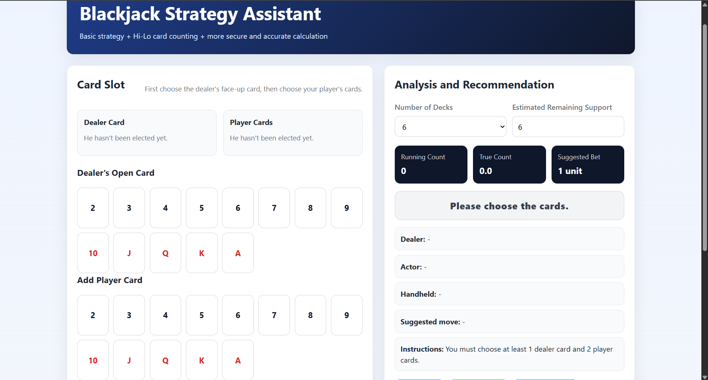
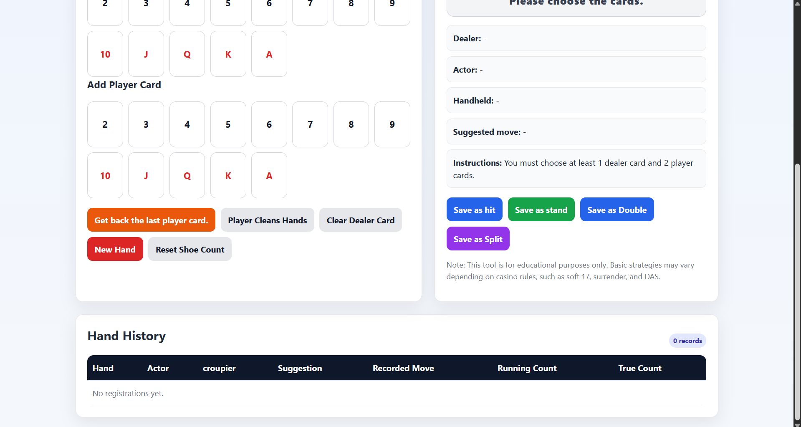

# Blackjack Strategy Assistant

An interactive single-page web application that helps players study **basic blackjack strategy** together with the **Hi-Lo card counting system**.

---

## Preview

### Game Screen




---

## Features

- Select dealer upcard and player cards visually
- Calculates player hand total
- Detects:
  - hard hands
  - soft hands
  - pairs
  - bust states
- Gives basic strategy recommendations:
  - Hit
  - Stand
  - Double
  - Split
- Tracks **Running Count**
- Calculates **True Count**
- Suggests a simple betting level based on count
- Stores round history in a table
- Fully client-side, no backend required

## Technologies Used

- HTML5
- CSS3
- Vanilla JavaScript

## How It Works

The application combines two ideas:

1. **Basic Blackjack Strategy**  
   It checks the player's hand type and the dealer's upcard, then looks up the recommended move from built-in strategy tables.

2. **Hi-Lo Card Counting**  
   Each visible card updates the running count:
   - Low cards (2–6): +1
   - Neutral cards (7–9): 0
   - High cards (10, J, Q, K, A): -1

The app then estimates the **True Count** using the remaining deck value entered by the user.

## Project Structure

```
blackjack-strategy-assistant/
├── index.html
├── README.md
├── screenshots/
│   ├── main-screen1.png
└── └── main-screen2.png
```

## Usage

1. Open `index.html` in your browser.
2. Select the dealer's visible card.
3. Add the player's cards.
4. Review the suggested move.
5. Optionally log the action into the hand history table.
6. Adjust deck count and remaining decks to update the true count.

## Screenshots

Add your screenshots to the `screenshots/` folder and reference them here:

```


```

## Notes

- This project is intended for **educational and training purposes**.
- Strategy may differ depending on casino rule variations such as:
  - dealer stands/hits on soft 17
  - surrender availability
  - DAS (double after split)

## Limitations

- No backend persistence
- No advanced rule customization yet
- No probability simulation engine
- No local storage support for saved sessions

## Possible Improvements

- Add rule presets (S17 / H17 / DAS / surrender)
- Add localStorage save/load
- Add mobile optimization improvements
- Add dark mode
- Add expected value / odds view
- Add keyboard shortcuts
- Add GitHub Pages deployment

## License

This project is shared for educational portfolio purposes.
## `MIT License`

---

# Author

Jafar Hasanli
Computer Science Student
Eötvös Loránd University (ELTE)
